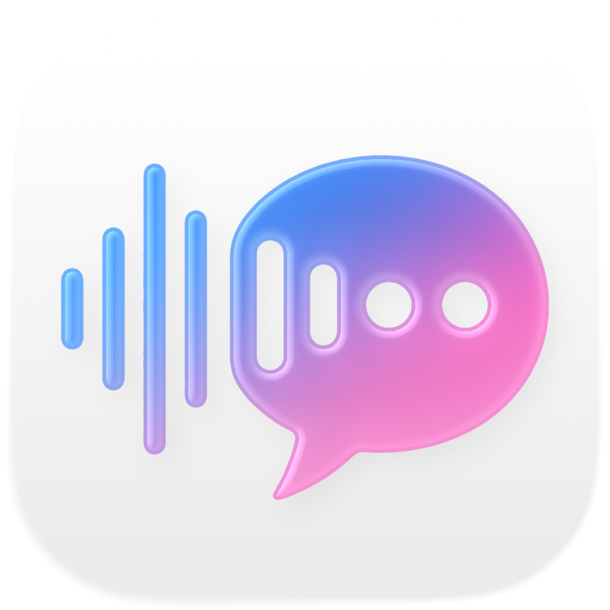

  
  
  <h1>RecordCraft</h1>
  
<b>The Ultimate On-Device AI Audio Workspace for Apple Silicon</b>

  
  

    
    
    
  

   

> **RecordCraft**  is a privacy-first local AI audio recording, transcription, and summarization app. Built natively for iPhone, iPad, and Mac, it captures spoken content, turns it into readable text, identifies speakers, generates AI summaries, and keeps everything organized in one place. Built around a local-first workflow, RecordCraft keeps all processing completely on device for a private, responsive, and streamlined experience.

 

## Core Experience

### Key features on iPhone & iPad
- **Privacy-first:** Record audio directly in the app, then generate transcripts, identify speakers, and create AI summaries—without ever moving files to the cloud.
- **Apple Speech integration:** Leverages Apple Speech with downloadable on-device language models for both real-time and post-recording transcription.
- **Advanced speaker identification:** Speaker identification is powered by on-device diarization, accurately parsing who said what.
- **Local AI summaries:** Summaries are generated entirely on device using supported local models such as Google Gemma 3, with additional models to be added over time, as well as Apple Foundation Models powered by Apple Intelligence.
- **Organization, metadata, and batch processing:** Keep everything organized with folders, pins, audio import and export, robust search, metadata support, mark recording location, and batch processing for multiple recordings. Perfect for meetings, lectures, interviews, presentations, and personal notes.
- **Clean Liquid Glass design:** Fully embraces Liquid Glass design with a polished interface, including a Liquid Glass recording panel and fluid controls.
- **iOS 26 and iPadOS 26 integration:** Features a modern Apple-native experience with Live Activities, Dynamic Island, Control Center integration, and Home Screen quick actions for faster access. Also supports microphone selection on iPhone and iPad, as well as low-latency AirPods recording.

### Key features on Mac
- **Privacy-first:** Record audio directly in the app, then generate transcripts, identify speakers, and create AI summaries—without ever moving files to the cloud.
- **System audio and microphone recording:** Supports both microphone input and system audio recording, making it ideal for online meetings, remote lectures, streamed presentations, and other desktop audio workflows.
- **On-device transcription:** Supports Apple Speech with downloadable on-device language models and Whisper models (via WhisperKit) of different sizes for both real-time and post-recording transcription.
- **Advanced speaker identification:** Speaker identification is powered by on-device diarization, accurately parsing who said what.
- **Local AI summaries:** Summaries are generated entirely on device using supported local models such as Google Gemma 3 in different sizes, with additional models to be added over time, as well as Apple Foundation Models powered by Apple Intelligence.
- **Organization, metadata, and batch processing:** Keep everything organized with folders, pins, audio import and export, robust search, metadata support, mark recording location, and batch processing for multiple recordings. Perfect for meetings, lectures, interviews, presentations, and personal notes.
- **Clean Liquid Glass design:** Fully embraces Liquid Glass design with a polished interface, including a Liquid Glass recording panel and fluid controls.
- **macOS 26 integration:** Quickly access core recording controls from the menu bar without reopening the full app window, fitting naturally into everyday macOS multitasking. Also supports microphone selection, meeting detection for apps such as Zoom, and low-latency AirPods recording.

> RecordCraft brings together audio recording, transcription, speaker identification, AI summarization, organization, and batch processing in one privacy-first on-device workspace. For users who want a more private, more local, and more capable way to work with spoken content, RecordCraft provides a complete solution on Mac.

 

## App Preview

  <h3>iPhone</h3>
  
  
  
   
  
  
  
  
    

  <h3>Mac</h3>
  
  
   
  
  

    

  <h3>iPad</h3>
  
  
   
  
  
   
  

 

---

## Legal & Support Documentation

For App Store reviewers and users, please find the official legal documentation, privacy policies, and support contacts in the respective files below:

- [**Contact & Support**](Support.md)
- [**Privacy Policy**](Privacy.md)
- [**Privacy Choices**](Privacy-Choices.md)
- [**Terms of Use**](Terms.md)

---
*© 2026 RecordCraft. Built with care.*
